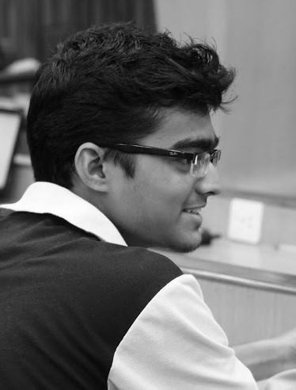

I am a Computer Science student, working on machine learning and deep learning methods for language and speech processing. In the past, I have also worked on pattern recognition, fuzzy logic systems, and computer vision.

I graduated from IIT Guwahati in 2017 with a major in Computer Science. In fall 2018, I will be joining the PhD program at [Johns Hopkins University](https://www.cs.jhu.edu/), working in the [Center for Language and Speech Processing (CLSP)](https://www.clsp.jhu.edu/).

When I'm not doing ML, I like to work out, swim, play the guitar, and read fiction.

